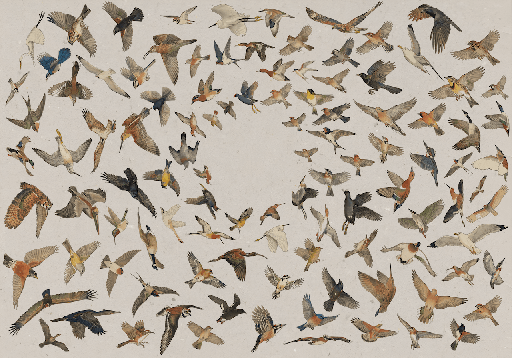

# AvianVisitors

*A live bird collage from your apartment window.*

A frontend overlay for [BirdNET-Pi](https://github.com/Nachtzuster/BirdNET-Pi). Listens to your balcony, identifies every passing bird with Cornell's [BirdNET](https://birdnet.cornell.edu/), and renders the detections as a tile-packed kachō-e print at `http://birdnet.local/collage/`. Full project writeup at [teddywarner.org/Projects/AvianVisitors](https://teddywarner.org/Projects/AvianVisitors/).



---

## BOM

| Qty | Description | Price | Link | Notes |
|-----|-------------|-------|------|-------|
| 1 | Raspberry Pi (4B / 5 / Zero 2W) | ~$35–80 | [Raspberry Pi](https://www.raspberrypi.com/products/) | 4B+ recommended |
| 1 | Micro SD Card | ~$10 | [Amazon](https://a.co/d/08aiL8c) | ≥32 GB |
| 1 | USB Lavalier Microphone | $14.99 | [Amazon](https://www.amazon.com/dp/B0176NRE1G) | The one I used. Any USB mic with a half-decent capsule works. |
| 1 | Pi Power Supply | ~$10 | — | Matched to your Pi model |

You'll also need a [Gemini API key](https://aistudio.google.com/apikey) (free tier is enough for an apartment-scale lifelist) and, optionally, an [eBird API key](https://ebird.org/api/keygen) for region-filtering the species pre-gen.

---

## 1. Install BirdNET-Pi

Follow the [BirdNET-Pi installation guide](https://github.com/mcguirepr89/BirdNET-Pi/wiki/Installation-Guide) on your Pi. Confirm the stock BirdNET-Pi UI is reachable at `http://birdnet.local/` before continuing.

---

## 2. Clone AvianVisitors

```bash
ssh monalisa@birdnet.local
git clone https://github.com/Twarner491/AvianVisitors.git ~/AvianVisitors
cd ~/AvianVisitors
```

---

## 3. Pre-generate illustrations for your region (optional but recommended)

The repo ships with ~450 bundled illustrations. To restyle, regenerate, or add region-specific species, run the pregen script with your Gemini key.

```bash
export GEMINI_API_KEY='your-gemini-key'

# Generate every species BirdNET-Pi knows:
python3 avian/scripts/pregen.py --labels ~/BirdNET-Pi/model/labels.txt

# Or filter to species observed in your state/county via eBird:
export EBIRD_API_KEY='your-ebird-key'
python3 avian/scripts/pregen.py \
  --labels ~/BirdNET-Pi/model/labels.txt \
  --ebird-region US-CA   # state, or US-CA-085 for a county
```

To change the art style, edit [`avian/scripts/prompt.template.md`](avian/scripts/prompt.template.md) and re-run with `--force`. The template has `{sci_name}`, `{com_name}`, and `{pose}` placeholders; swap the body for whatever style you want (woodblock, ink wash, scientific plate, etc.).

---

## 4. Install the frontend

One-shot installer — drops the static collage UI into `/var/www/avian`, the JSON shims into BirdNET-Pi's PHP root, and a Caddy snippet that mounts everything at `http://birdnet.local/collage/`.

```bash
bash avian/scripts/install.sh
```

That's it. Open `http://birdnet.local/collage/` from any device on your network. As BirdNET-Pi accumulates detections, they fade into the collage — sized by how often each species has been heard.

---

## 5. Loading the Gemini key on the Pi (for live JIT generation)

The bundled illustrations cover most North-American species. For new birds the Pi hasn't seen before, AvianVisitors can render them on the fly. Drop the key into a systemd environment file so the JIT generator picks it up:

```bash
sudo mkdir -p /etc/avian
echo "GEMINI_API_KEY=your-gemini-key" | sudo tee /etc/avian/env >/dev/null
sudo chmod 600 /etc/avian/env
sudo systemctl restart php8.2-fpm
```

The PHP shim at `avian/api/cutout.php` reads `/etc/avian/env` and falls through to a Wikipedia photo if the key is missing — so you can run completely Gemini-free if you'd rather.

---

## 6. Optional: forward off your local network

For public access, Home Assistant integration, or MQTT fan-out, see [`avian/forwarding/`](avian/forwarding/). Each recipe is independent:

- **Cloudflare Tunnel** — public HTTPS URL, no port forwarding, optional Cloudflare Access for password protection.
- **Home Assistant REST sensor** — surfaces the latest detection as a sensor.value for automations.
- **MQTT bridge** — publishes every new detection to a broker as JSON.

---

## Repo layout

```
avian/
├── frontend/         # static HTML/JS/CSS for the collage
├── assets/           # bundled illustrations + cutouts + masks
├── api/              # PHP shims served by BirdNET-Pi's existing PHP-FPM
├── scripts/          # installer + Gemini pregen + editable prompt
├── caddy/            # snippet mounting /collage on existing Caddy
└── forwarding/       # optional HA / MQTT / Cloudflare configs
```

Everything outside `avian/` is upstream BirdNET-Pi.

---

## License

CC-BY-NC-SA-4.0 (inherited from BirdNET-Pi). Non-commercial use only; share-alike on derivatives. See [`LICENSE`](LICENSE) and [`README.upstream.md`](README.upstream.md).

---

- [Fork this repository](https://github.com/Twarner491/AvianVisitors/fork)
- [Watch this repo](https://github.com/Twarner491/AvianVisitors/subscription)
- [Create issue](https://github.com/Twarner491/AvianVisitors/issues/new)
